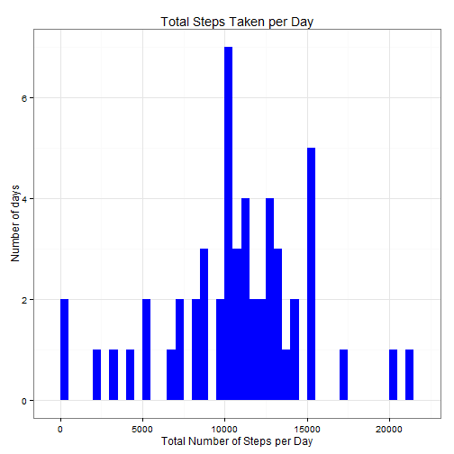
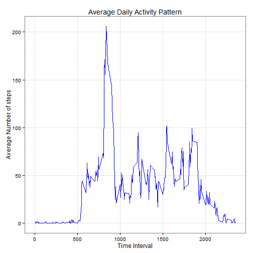
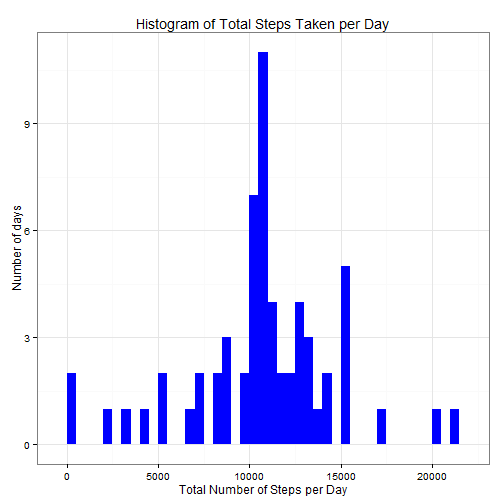
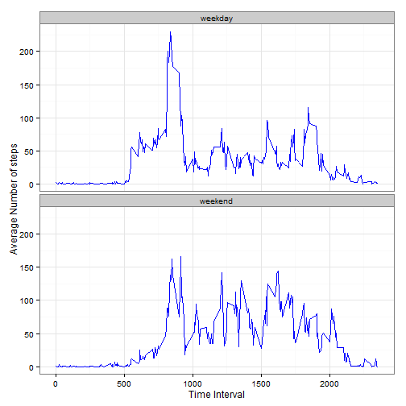

This Assignment assumes that you have already downloaded and unzipped the dataset into your working folder. If not, the zip file can be downloaded from [here: ](https://d396qusza40orc.cloudfront.net/repdata%2Fdata%2Factivity.zip)

We start by loading the required libraries:

```r
library(plyr)
library(ggplot2)
```

***  

##A) Loading and preprocessing the data  


**Objective 1:** Load the data using read.csv  

We load the csv data into a data frame in R using the following code:  

```r
activity <- read.csv('activity.csv')
str(activity)
```

```
## 'data.frame':	17568 obs. of  3 variables:
##  $ steps   : int  NA NA NA NA NA NA NA NA NA NA ...
##  $ date    : Factor w/ 61 levels "2012-10-01","2012-10-02",..: 1 1 1 1 1 1 1 1 1 1 ...
##  $ interval: int  0 5 10 15 20 25 30 35 40 45 ...
```

```r
head(activity)
```

```
##   steps       date interval
## 1    NA 2012-10-01        0
## 2    NA 2012-10-01        5
## 3    NA 2012-10-01       10
## 4    NA 2012-10-01       15
## 5    NA 2012-10-01       20
## 6    NA 2012-10-01       25
```
*Note: We have "NA"s in the steps column and the date is loaded as Factors, which we need to change to the proper date format*  


**Objective 2:** Process/transform the data (if necessary) into a format suitable for your analysis.  

We transform the date into the date formatwith the following code:  

```r
activity$date <- as.Date(activity$date, format = "%Y-%m-%d")
str(activity)
```

```
## 'data.frame':	17568 obs. of  3 variables:
##  $ steps   : int  NA NA NA NA NA NA NA NA NA NA ...
##  $ date    : Date, format: "2012-10-01" "2012-10-01" ...
##  $ interval: int  0 5 10 15 20 25 30 35 40 45 ...
```

***  

##B) What is mean total number of steps taken per day?  
For this part of the assignment, we can ignore the missing values in the dataset.


**Objective 1:** Calculate the total number of steps taken per day.  

We create a subset and calculate the total number of steps taken per day by summing up the steps, grouped by date, with the following code:

```r
totalstepsperday <- aggregate(steps ~ date, activity, sum)
head(totalstepsperday)
```

```
##         date steps
## 1 2012-10-02   126
## 2 2012-10-03 11352
## 3 2012-10-04 12116
## 4 2012-10-05 13294
## 5 2012-10-06 15420
## 6 2012-10-07 11015
```


**Objective 2:** Make a histogram of the total number of steps taken each day.  

We use the ggplot library to plot the Histogram with the following code:

```r
g <- ggplot(totalstepsperday, aes(x = steps))
p <- g + geom_histogram(fill = "blue", binwidth = 500) + labs(title="Total Steps Taken per Day", x = "Total Number of Steps per Day", y = "Number of days") + theme_bw()
print(p)
```

 


**Objective 3:** Calculate and report the mean and median of the total number of steps taken per day  

The mean and median are calculated as follows:

```r
mean_totalsteps <- mean(totalstepsperday$steps)
median_totalsteps <- median(totalstepsperday$steps)
```
- Mean: 1.0766189 &times; 10<sup>4</sup>  
- Median: 10765  

***  

##C) What is the average daily activity pattern?  


**Objective 1:** Make a time series plot (i.e. type = "l") of the 5-minute interval (x-axis) and the average number of steps taken, averaged across all days (y-axis)  

We create another subset and calculate the average number of steps, grouped by time interval:

```r
avgstepsperinterval <- aggregate(steps ~ interval, activity, FUN=mean, na.rm=TRUE)
colnames(avgstepsperinterval) <- c("interval", "avgsteps")
head(avgstepsperinterval)
```

```
##   interval  avgsteps
## 1        0 1.7169811
## 2        5 0.3396226
## 3       10 0.1320755
## 4       15 0.1509434
## 5       20 0.0754717
## 6       25 2.0943396
```

```r
str(avgstepsperinterval)
```

```
## 'data.frame':	288 obs. of  2 variables:
##  $ interval: int  0 5 10 15 20 25 30 35 40 45 ...
##  $ avgsteps: num  1.717 0.3396 0.1321 0.1509 0.0755 ...
```
Then we make a time series plot:

```r
g1 <- ggplot(avgstepsperinterval, aes(x=interval, y=avgsteps))
p1 <- g1 + geom_line(color="blue", type=1) + labs(title="Average Daily Activity Pattern", x="Time Interval", y="Average Number of steps") +  theme_bw()
print(p1)
```

 


**Objective 2:** Which 5-minute interval, on average across all the days in the dataset, contains the maximum number of steps?  


```r
interval_maxsteps <- avgstepsperinterval[which.max(avgstepsperinterval$avgsteps),]
```
The time interval which has the maximun number of steps, on the average across all days is: 835

***

##D) Imputing missing values


As noted in the begining when examining the original dataset, there a number of days/intervals where there are missing values (coded as NA). The presence of missing days may introduce bias into some calculations or summaries of the data.  

**Objective 1:** Calculate and report the total number of missing values in the dataset (i.e. the total number of rows with NAs)  

We use the is.na method to check for missing values:

```r
totalmissingvalues <- sum(is.na(activity$steps))
```
There are a total of 2304 missing values


**Objective 2:** Devise a strategy for filling in all of the missing values in the dataset. The strategy does not need to be sophisticated. For example, you could use the mean/median for that day, or the mean for that 5-minute interval, etc.  
**Objective 3:** Create a new dataset that is equal to the original dataset but with the missing data filled in.  

We use the impute.mean function to replace the missing values with the mean , grouped by interval  
We also use ddply from the plyr Library to apply the impute.mean function on the original data frame.  
We create a new dataset for this so as to leave the original dataset intact.

```r
impute.mean <- function(x) replace(x, is.na(x), mean(x, na.rm = TRUE))
activity_completedata <- ddply(activity, ~ interval, transform, steps = impute.mean(steps))
str(activity_completedata)
```

```
## 'data.frame':	17568 obs. of  3 variables:
##  $ steps   : num  1.72 0 0 47 0 ...
##  $ date    : Date, format: "2012-10-01" "2012-10-02" ...
##  $ interval: int  0 0 0 0 0 0 0 0 0 0 ...
```

```r
head(activity_completedata)
```

```
##       steps       date interval
## 1  1.716981 2012-10-01        0
## 2  0.000000 2012-10-02        0
## 3  0.000000 2012-10-03        0
## 4 47.000000 2012-10-04        0
## 5  0.000000 2012-10-05        0
## 6  0.000000 2012-10-06        0
```
We then check the new dataset for NA values. It should not have any.  

```r
newtotalmissingvalues <- sum(is.na(activity_completedata$steps))
```
Check: 0 missing values in new dataset.


**Objective 4:** Make a histogram of the total number of steps taken each day and Calculate and report the mean and median total number of steps taken per day. Do these values differ from the estimates from the first part of the assignment? What is the impact of imputing missing data on the estimates of the total daily number of steps?  

We repeat the analysis done in Part B, but with the new dataset:

```r
totalstepsperday_completedata <- aggregate(steps ~ date, activity_completedata, FUN=sum)
head(totalstepsperday_completedata)
```

```
##         date    steps
## 1 2012-10-01 10766.19
## 2 2012-10-02   126.00
## 3 2012-10-03 11352.00
## 4 2012-10-04 12116.00
## 5 2012-10-05 13294.00
## 6 2012-10-06 15420.00
```


```r
g2 <- ggplot(totalstepsperday_completedata, aes(x = steps))
p2 <- g2 + geom_histogram(fill = "blue", binwidth = 500) + labs(title="Histogram of Total Steps Taken per Day", x = "Total Number of Steps per Day", y = "Number of days") + theme_bw()
print(p2)
```

 


```r
mean_totalsteps_completedata <- mean(totalstepsperday_completedata$steps)
median_totalsteps_completedata <- median(totalstepsperday_completedata$steps)
```
- Before imputing missing data:  
    Mean: 1.0766189 &times; 10<sup>4</sup>  
    Median: 10765  
- After imputing missing data:  
    Mean: 1.0766189 &times; 10<sup>4</sup>  
    Median: 1.0766189 &times; 10<sup>4</sup>  

We observed that only the median differs very slightly from the first part of the assignment.  
Comparing the Histograms, Imputing the missing values has pushed up the peak of the distribution and shifted the median slightly. The shape of the distribution has remained unchanged.  

Assuming the person's activity follows a similar pattern at the same time intervals, when we replace the missing values with the average number of steps at that particular time interval, we can see that the number of days when the Median number of steps were taken has increased.  


***

##E) Are there differences in activity patterns between weekdays and weekends?


For this part the weekdays() function may be of some help here. Use the dataset with the filled-in missing values for this part.

**Objective 1:** Create a new factor variable in the dataset with two levels - "weekday" and "weekend" indicating whether a given date is a weekday or weekend day.  

We use the wday component of the POSIXlt object to check which day it is, 0-6 starting on Sunday.

```r
activity_completedata$daytype <-  ifelse(as.POSIXlt(activity_completedata$date)$wday %in% c(0,6), 'weekend', 'weekday')
head(activity_completedata)
```

```
##       steps       date interval daytype
## 1  1.716981 2012-10-01        0 weekday
## 2  0.000000 2012-10-02        0 weekday
## 3  0.000000 2012-10-03        0 weekday
## 4 47.000000 2012-10-04        0 weekday
## 5  0.000000 2012-10-05        0 weekday
## 6  0.000000 2012-10-06        0 weekend
```


**Objective 2:** Make a panel plot containing a time series plot (i.e. type = "l") of the 5-minute interval (x-axis) and the average number of steps taken, averaged across all weekday days or weekend days (y-axis). See the README file in the GitHub repository to see an example of what this plot should look like using simulated data.  

We create another subset of the complete data and calculate the average number of steps, grouped by time interval, by day type:

```r
avgstepsperinterval_completedata <- aggregate(steps ~ interval*daytype, activity_completedata, FUN=mean, na.rm=TRUE)
str(avgstepsperinterval_completedata)
```

```
## 'data.frame':	576 obs. of  3 variables:
##  $ interval: int  0 5 10 15 20 25 30 35 40 45 ...
##  $ daytype : chr  "weekday" "weekday" "weekday" "weekday" ...
##  $ steps   : num  2.251 0.445 0.173 0.198 0.099 ...
```

```r
head(avgstepsperinterval_completedata)
```

```
##   interval daytype      steps
## 1        0 weekday 2.25115304
## 2        5 weekday 0.44528302
## 3       10 weekday 0.17316562
## 4       15 weekday 0.19790356
## 5       20 weekday 0.09895178
## 6       25 weekday 1.59035639
```
We then make a time series line plot on 2 rows and 1 column:

```r
g3 <- ggplot(avgstepsperinterval_completedata, aes(x=interval, y=steps)) 
p3 <- g3 + geom_line(color="blue", type=1) + facet_wrap(~ daytype, nrow=2, ncol=1) + labs(x="Time Interval", y="Average Number of steps") +theme_bw()
print(p3)
```

 

***
###END
